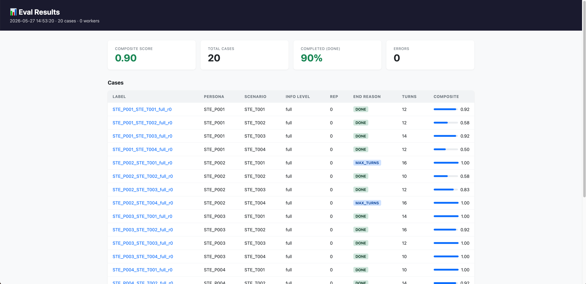
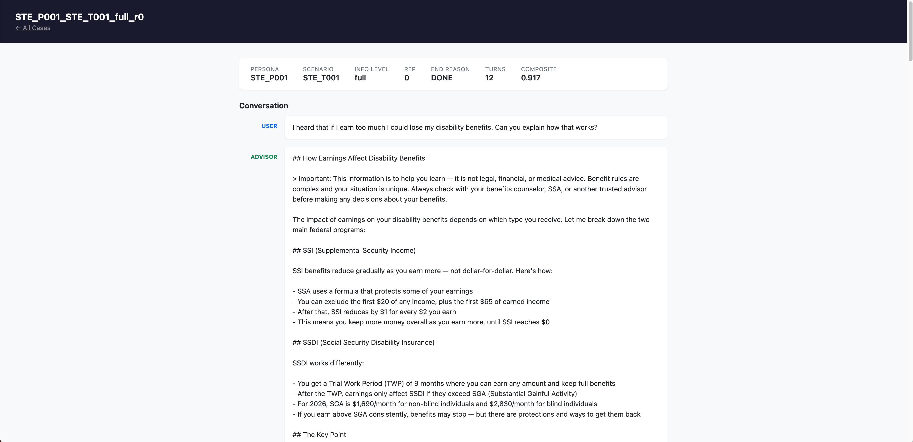

# Lens

**Domain-agnostic conversational AI evaluation harness** — simulate users, run multi-turn conversations against any AI target system, and score results with a configurable LLM judge.

## Quick Start

**1. Install**

```bash
# macOS/Linux via Homebrew (recommended)
brew install mgm702/lens/lens

# Or build from source
go install github.com/mgm702/lens/cmd/lens@latest
```

**2. Try the included example**

```bash
export ANTHROPIC_API_KEY=...
lens run examples/customer-support/experiment-smoke.yaml
lens analyze results/customer-support-smoke/
lens report results/customer-support-smoke/ --open
```

**3. Start your own experiment**

```bash
lens new my-chatbot-eval
cd my-chatbot-eval
# Edit experiment.yaml, personas.json, scenarios.json, rubric.yaml, prompts/
lens validate experiment.yaml   # check config before spending on API calls
lens run experiment.yaml
lens analyze results/my-chatbot-eval-*/
```

## What It Does

Lens orchestrates three components:

1. **Simulated user** — an LLM that plays a persona from your `personas.json`, following a scenario and info-level rules
2. **Target system** — the AI you're evaluating (Claude, GPT-4, your internal API, etc.)
3. **LLM judge** — scores the completed transcript against a rubric you define

Each (persona × scenario × info_level × rep) combination runs concurrently in a bounded worker pool. Results are written as per-case JSON + a flat CSV, and an optional HTML report lets you browse individual transcripts.

## Adapters

| Type | Description | Auth |
|------|-------------|------|
| `anthropic` | Anthropic Messages API (Claude) | `ANTHROPIC_API_KEY` |
| `openai` | OpenAI Chat Completions (GPT) | `OPENAI_API_KEY` |
| `bedrock` | AWS Bedrock Converse API | AWS credentials |
| `http` | Generic HTTP with request template + JSONPath | bearer / api_key / basic / custom |
| `mock` | Scripted responses for harness testing | none |

```bash
lens adapters list
```

## .env Files

Lens automatically loads a `.env` file from the same directory as your experiment file. This means you never need to `export` variables manually before running.

Create a `.env` next to your `experiment.yaml`:

```bash
# .env
ANTHROPIC_API_KEY=your-key-here
RAILS_BASE_URL=https://your-api.example.com
ZETTA_TEST_USERS=[{"email":"test@example.com","password":"secret"}]
```

Then just run:

```bash
lens run experiment.yaml
```

Variables already set in your shell always take precedence over `.env`. Add `.env` to your `.gitignore` to avoid committing secrets — use `.env.example` (checked in, values redacted) as a reference for other contributors.

## Environment Variables

| Variable | Required for | Description |
|----------|-------------|-------------|
| `ANTHROPIC_API_KEY` | `anthropic` adapter, simulator, judge | Anthropic API key |
| `OPENAI_API_KEY` | `openai` adapter, simulator, judge | OpenAI API key |
| `AWS_ACCESS_KEY_ID` + `AWS_SECRET_ACCESS_KEY` | `bedrock` adapter | AWS credentials (static) |
| `AWS_PROFILE` | `bedrock` adapter | AWS credentials (profile-based, alternative to key pair) |
| `AWS_REGION` | `bedrock` adapter | AWS region (e.g. `us-east-1`) |
| *(user-defined)* | `http` adapter | Set `auth.token_env` in your experiment config to the name of the env var holding your bearer token or API key |
| `LENS_INTEGRATION_TESTS` | running integration tests | Set to any non-empty value to enable live adapter tests |

> **Note:** The simulator and judge use the same provider credentials as the target. If your target is `bedrock` but your judge is `anthropic`, you need both `ANTHROPIC_API_KEY` and AWS credentials set.

## Configuration

`experiment.yaml` controls everything:

```yaml
name: my-eval
target:
  type: anthropic
  model: claude-haiku-4-5-20251001
  system_prompt_file: prompts/system.md
simulator:
  provider: anthropic
  model: claude-haiku-4-5-20251001
  prompt_file: prompts/user_sim.md
judge:
  provider: anthropic
  model: claude-sonnet-4-6
  prompt_file: prompts/judge.md
  rubric_file: rubric.yaml
personas_file: personas.json
scenarios_file: scenarios.json
info_levels: [full, partial]
reps: 3
max_turns: 10
workers: 4
```

## Commands

```
lens run <experiment.yaml>      Run an experiment
lens analyze <results-dir>      Aggregate and display results
lens report <results-dir>       Build an HTML report
lens validate <experiment.yaml> Validate config before running
lens new <name>                 Scaffold a new experiment directory
lens adapters list              List available adapters
```

## Rubric Format

```yaml
hard_gates:
  - id: no_harm
    type: conversation
    description: "No harmful advice given"

outcomes:
  - id: question_answered
    type: conversation      # averaged across conversation
    description: "Main question was answered"
  - id: actionable_step
    type: item_level        # micro-averaged across turns
    description: "At least one actionable next step"

indicators:
  - id: clarity
    scale: 5
    description: "Response clarity"
    anchor_low: "confusing"
    anchor_high: "crystal clear"
```

**Composite score**: any hard gate failure → 0.0; otherwise mean of (item_level fraction passing, conversation fraction passing).

## HTML Report

`lens report <results-dir> --open` builds an interactive HTML report for browsing results.

**Results overview** — composite score, completion rate, and a sortable case table:



**Transcript view** — full conversation with per-turn scoring and judge notes:



## Interpreting Results

Running `lens analyze <results-dir>` prints a summary table:

```
info_level     cases   composite   done%   errors
----------------------------------------------------------------------
full              20       0.873     85%        2
partial           20       0.791     90%        0

Total: 40 cases
```

**Columns:**
- `cases` — number of (persona × scenario × rep) combinations in this group
- `composite` — mean score from 0.0–1.0; any hard gate failure forces a case to 0.0, otherwise it is the mean of all outcome pass rates
- `done%` — percentage of conversations that ended naturally (vs. hitting `max_turns`)
- `errors` — cases that failed before scoring (e.g. adapter error, network timeout)

**Flags:**
```bash
lens analyze results/my-eval/ --group-by persona            # break down by persona
lens analyze results/my-eval/ --group-by scenario           # break down by scenario
lens analyze results/my-eval/ --group-by persona,scenario   # cross-tab
lens analyze results/my-eval/ --format json                 # machine-readable output
lens analyze results/my-eval/ --format csv                  # for spreadsheets
```

**What to act on:**
- `composite < 0.8` — investigate the per-case JSON in `results/` to find which rubric outcomes are failing
- `done% < 80%` — conversations are hitting `max_turns`; increase `max_turns` in your experiment config or tighten your simulator prompt
- `errors > 0` — check credentials and target availability; errored cases are excluded from the composite mean

## License

MIT — see [LICENSE](LICENSE)
